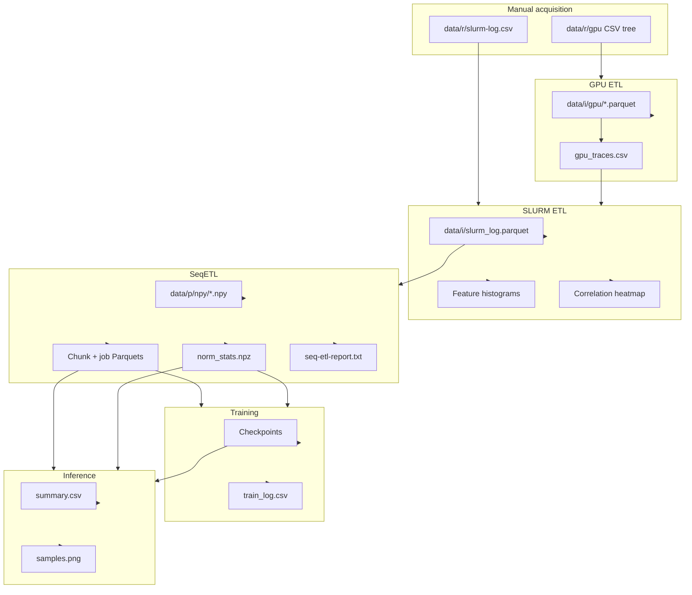
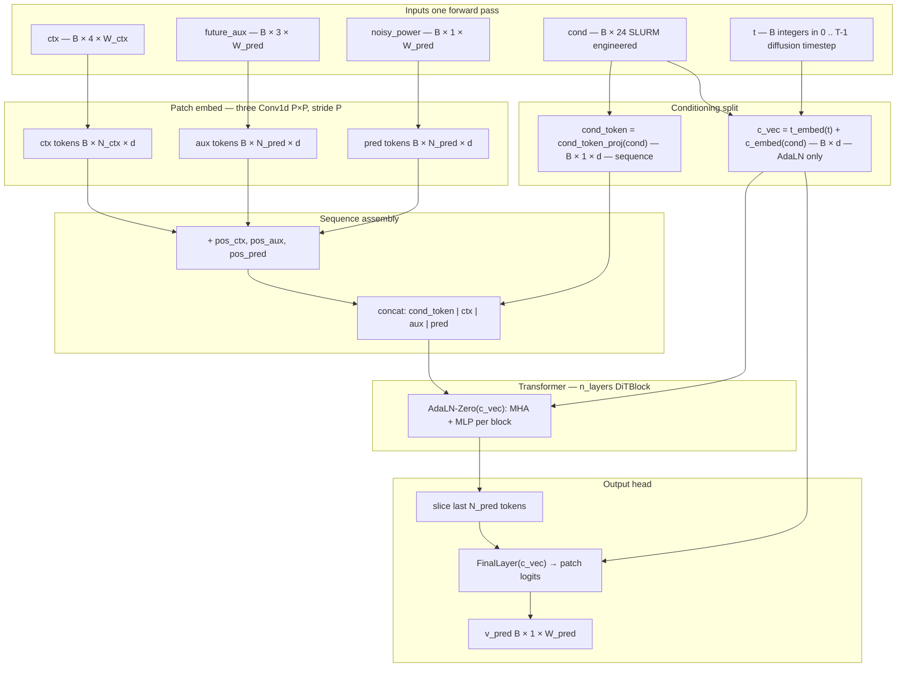

# Project Report: Generative GPU Power Modeling for MIT SuperCloud

**Software artifact:** `supercloud-power` (Python package, version 0.1.0)  
**Primary objective:** Build an end-to-end system that ingests SLURM scheduling metadata and time-aligned GPU telemetry, then trains a conditional diffusion model (**DiT-AR v5**) to synthesize **GPU power draw** trajectories under realistic operational constraints.

This document serves as both the **technical report** for the project and the **operator guide** for reproducing the pipeline. Repository paths and hyperparameters may evolve; authoritative numeric settings live in `configs/*.yaml`.

---

## Executive summary

The project addresses **data-driven modeling of GPU power consumption** on a shared HPC cluster. Raw inputs consist of (1) **per-job, per-node GPU metric CSVs** and (2) a **SLURM accounting export**. After deterministic preprocessing (resampling, cross-node aggregation, feature engineering, and normalization), each job becomes a **four-channel time series** at approximately **0.103 s** resolution. A **sliding-window autoregressive diffusion transformer** predicts the **power** channel conditioned on **24-dimensional SLURM features** and **observed future auxiliary signals** (utilization and memory footprint). Training supports **multi-GPU DDP**; evaluation on held-out **test jobs** reports **Pearson correlation**, **RMSE**, and **MAE** in watts, alongside qualitative **trace plots**.

---

## 1. Introduction

### 1.1 Motivation

Understanding and forecasting GPU power draw supports capacity planning, scheduling policies, and energy-aware workload management. Fully physics-based models are difficult to calibrate across heterogeneous workloads; this project instead learns a **generative model** directly from **operational telemetry** tied to **job-level scheduler context**.

### 1.2 Problem statement

Given a job’s **scheduler-derived conditioning vector** and a **fixed-length history** of multivariate GPU signals (including partial knowledge of the future auxiliary channels within each prediction window), estimate the **future power trajectory** so that synthetic traces are statistically plausible compared to held-out measurements.

### 1.3 Scope

**In scope:** offline batch ETL, model training, batch inference, standardized metrics and plots, example SLURM driver scripts.  
**Out of scope:** live integration with the scheduler, automated raw-data ingestion from SuperCloud (operators supply exports), and certification of safety or fairness claims beyond documented metrics.

---

## 2. System overview

The implementation splits naturally into **CPU-bound data preparation** and **GPU-bound learning**:

| Layer | Technology | Function |
|-------|------------|----------|
| ETL | pandas, pyarrow, multiprocessing | Cleaning, alignment, joins, Parquet/NPY materialization |
| Modeling | PyTorch | DiT-AR v5, diffusion training, optional DDP |
| Evaluation | NumPy, matplotlib (Agg) | Scalar metrics and publication-style trace overlays |

Figure A‑1 (Appendix A) summarizes file-level dependencies between stages; Figure B‑1 (Appendix B) summarizes the DiT-AR v5 forward dataflow.

---

## 3. Data and assumptions

### 3.1 Raw inputs (operator-supplied)

The codebase does **not** download cluster data. Operators must place:

- **`data/r/gpu/`** — Tree of CSV files conforming to `configs/gpuETL.yaml` (`glob_pattern`, `filename_pattern` extracting `job_id`).
- **`data/r/slurm-log.csv`** — SLURM export with columns listed under `slurm_usecols` in `configs/slurmETL.yaml`.

**Assumption:** `job_id` values are **consistent** across GPU filenames and SLURM `id_job` (after rename). SLURM rows without a corresponding GPU trace are **dropped** by an inner merge.

### 3.2 Derived channel semantics

Each prepared trace is **`(4, T)` float32** with channel order:

1. `gpu_used_pct` — linear scaling from percentage toward approximately \([-1, 1]\).  
2. `memory_used_pct` — same.  
3. `memory_used_MiB` — \(\log(1+x)\) then **train-fit** z-score.  
4. `power_draw_W` — \(\log(1+x)\) then **train-fit** z-score; **sole diffusion target**.

Normalization statistics are computed **only from training jobs** and stored in `norm_stats.npz`.

### 3.3 Train / test protocol

**SeqETL** performs a **job-level** split (`test_frac`, `seed`; optional stratification). There is **no separate validation split** inside the training loop; **generalization is assessed** by running **inference on test jobs** (Section 6).

---

## 4. Methodology

### 4.1 Stage 1 — GPU ETL

**Implementation:** `src/etl/gpu.py`, configuration `configs/gpuETL.yaml`.  
**Procedure (summary):** Discover jobs; optionally skip completed Parquets; per-node CSV filtering by inferred sampling interval; binning to a dense grid; cross-node aggregation (mean vs sum per metric); job-level quality gates (`min_node_keep_ratio`); atomic Parquet writes with **footer metadata** (`job_id`, `length`, `duration_sec`, `delta_t`, `nodes_used`); rebuild **`gpu_traces.csv`** with optional **duration bounds** filtering.

**Operational note:** A full pass requires invoking **`GpuETL().run()`**. Running `python src/etl/gpu.py` alone executes **trace index reconstruction** only, not CSV→Parquet conversion (Appendix C).

### 4.2 Stage 2 — SLURM ETL

**Implementation:** `src/etl/slurm.py`, configuration `configs/slurmETL.yaml`.  
**Procedure:** Inner merge of SLURM table with `gpu_traces.csv`; feature construction (cyclical time features, quantile transforms, one-hot encodings); export **`slurm_log.parquet`**.  
**Diagnostic outputs:** Histogram grid (`paths.plot`) and correlation heatmap (`paths.corr`), requiring matplotlib, seaborn, and scikit-learn.

### 4.3 Stage 3 — Sequence ETL (SeqETL)

**Implementation:** `src/etl/seq.py`, configuration `configs/seqETL.yaml`.  
**Procedure:** Five phases — load merged table; stratified split; fit normalization on train; convert Parquets to NPY with clipping and atomic writes; build **`train_*` / `test_*` chunk and job** Parquet indices. A textual **`seq-etl-report.txt`** captures phase logs; nonzero exit indicates NPY conversion failures.

**Fast path:** `python src/etl/seq.py --chunks-only` rebuilds chunk indices when window geometry changes but NPY files remain valid.

### 4.4 Model — DiT-AR v5

**Implementation:** `src/model/ditArV5.py`; hyperparameters in `configs/v5.yaml`.

The model is a **diffusion transformer** with:

- **Patch embedding** over context (`W_ctx`), future auxiliary (`W_pred`), and noisy power tokens (`W_pred`).  
- **AdaLN-Zero** modulation from the SLURM conditioning vector and diffusion timestep embedding.  
- **v-prediction** objective with a **cosine** \(\beta\) schedule (`diffusion_T` steps).  
- Optional **gradient checkpointing** (`use_checkpoint`) for memory-constrained GPUs.

**Training** (`src/model/train.py`): masked MSE respecting job length (`pred_mask`), AdamW with warmup+cosine decay, gradient clipping, CFG-style conditioning dropout, **EMA** of weights, optional **scheduled sampling** noise injection on past power in late epochs, **mixed precision** (bf16 when supported), and **DDP** when multiple GPUs are visible. Checkpoints use atomic writes; **`ema.pt`** is preferred for downstream inference.

**Inference** (`src/model/inference.py`): Loads **`ema.pt`** (fallback **`last.pt`**) and **`norm_stats.npz`** (power channel \(\log(1+x)\) mean/std). Reads **`test_jobs.parquet`** with optional **`subsample_n`** / **`subsample_stratify_cols`**. For each job: load truth **NPY** \((4,L)\), build SLURM **`cond`** from configured columns; **autoregressive sliding windows** — real future **aux** (3 channels), **generated** past **power** in context after window 0 — each window denoised with **DDIM** (`ddim_steps`, \(\eta=0\)) and **CFG** (`cfg_scale`). Writes **`{inference_dir}/synth/{job_id}.npy`** (generated power in **normalized / z-score space**, same convention as training channel 3). **Scores:** per-job **Pearson \(r\)**, **RMSE**, **MAE** on **denormalized watts** (`expm1(z\cdot\sigma+\mu)\)); logged columns **`job_id`**, **`length`**, **`duration_min`**; everything appended to **`summary.csv`**; stdout prints mean/median \(r\), **`frac>0.30`**, mean/median RMSE/MAE. **Plots:** **`samples.png`** (`plot_n_samples`, default 6) — jobs sampled across **`duration_sec`** when present; stacked panels of real vs generated power (W) with per-panel \(r\), duration, **`nodes_req`**, mean/max watts (matplotlib **Agg**). Optional **`trace_{job_id}.csv`** (`save_per_job_traces`): timestep, **`real_power_W`**, **`synthetic_power_W`**.

Tensor shapes, token layout, and block connectivity are shown schematically in **Appendix B (Figure B‑1)**.

### 4.5 Configuration coupling

**Requirement:** `configs/v5.yaml` must remain consistent with `configs/seqETL.yaml` on `sequence.W_ctx`, `sequence.W_pred`, `sequence.stride`, `sequence.patch_size`, and the **`slurm_feature_cols`** list (24 dimensions). Inconsistency produces shape errors or silent distribution mismatch between training and inference.

---

## 5. Implementation and repository structure

| Component | Path | Role |
|-----------|------|------|
| GPU ETL config | `configs/gpuETL.yaml` | Raw CSV → Parquet + trace index |
| SLURM ETL config | `configs/slurmETL.yaml` | Join + engineered features |
| SeqETL config | `configs/seqETL.yaml` | NPY + chunk/job tables + stats |
| Pipeline config | `configs/v5.yaml` | Model, train, inference, paths |
| Dataset | `src/etl/chunk.py` | mmap-backed `PowerTraceDataset` |
| Training driver | `src/model/train.py` | DDP, AMP, logging, checkpoints |
| Thin launcher | `src/model/main.py` | Loads `configs/v5.yaml`, invokes training |
| Inference | `src/model/inference.py` | AR + DDIM + CFG generation; **`summary.csv`** metrics; **`samples.png`** |
| HW probe | `src/shared/detect_hw.py` | CPU/GPU discovery |
| Batch scripts | `scripts/train.sh`, `scripts/inference.sh` | Example SLURM submission |
| Interactive helper | `scripts/terminal.sh` | tmux / Jupyter tunnel workflow |

**Exploratory artifacts:** `src/etl/model_power_traces_v4.ipynb`, root `app.ipynb` (not required for batch reproduction).

---

## 6. Evaluation protocol

### 6.1 Metrics (inference driver)

For each successfully generated test job, **`inference.py`** compares denormalized **watts** along the **generated length** (truth truncated to match):

- **Pearson correlation** \(r\) between aligned real and synthetic series (**NaN** if either side has negligible variance).  
- **RMSE** \(\sqrt{\frac{1}{T}\sum_t (p_t-\hat{p}_t)^2}\) in watts.  
- **MAE** \(\frac{1}{T}\sum_t |p_t-\hat{p}_t|\) in watts.

**`summary.csv`** (under `paths.inference_dir`) stores one row per job: **`pearson_r`**, **`rmse`**, **`mae`**, **`job_id`**, **`length`** (bins), **`duration_min`** (assuming 0.103 s per bin). After the run, the script prints aggregate **mean/median** Pearson \(r\), **fraction of jobs with \(r>0.30\)** (finite-\(r\) rows only), and **mean/median** RMSE and MAE.

### 6.2 Figures and optional traces

- **SLURM ETL:** feature histograms and correlation heatmap (Section 4.2).  
- **Inference — `samples.png`:** reads **`synth/*.npy`** and ground-truth NPY paths from **`test_jobs`**; selects **`plot_n_samples`** jobs spread across **`duration_sec`** when that column exists; each subplot overlays **Real** vs **Generated** power (W); title includes **`job_id`**, **`nodes_req`**, approximate duration (minutes), panel-wise Pearson \(r\) on **normalized** traces for display, and mean/max W for real vs gen. Saved at **`{inference_dir}/samples.png`** (dpi 120).  
- **Optional — `trace_{job_id}.csv`:** if **`inference.save_per_job_traces`** is true, per-job CSV with **`timestamp_s`** (bin index \(\times\) 0.103), **`real_power_W`**, **`synthetic_power_W`**.

### 6.3 Training diagnostics

**`train_log.csv`** (under the checkpoint directory) records `step`, `epoch`, `lr`, `loss`, and `n_skipped` at configured intervals. This file is the primary artifact for diagnosing instability or divergence; the codebase does not emit automatic validation curves during training.

---

## 7. Reproducibility

### 7.1 Environment

- Python \(\geq\) 3.10  
- Editable install from repository root:

```bash
cd /path/to/supercloud_power
pip install -e ".[etl,train]"
```

Optional: `.[dev]` for pytest/ruff. SLURM plotting and inference figures require the additional libraries noted in Section 4.2 and Section 6.2.

### 7.2 Execution sequence

All commands assume the **repository root** as the working directory.

```bash
# Stage 1 — GPU ETL (full pass)
python -c "from src.etl.gpu import GpuETL; import sys; sys.exit(GpuETL().run())"

# Stage 2 — SLURM ETL (+ diagnostic plots)
python src/etl/slurm.py

# Stage 3 — SeqETL
python src/etl/seq.py

# Stage 4 — Training
python src/model/train.py --config configs/v5.yaml

# Stage 5 — Inference / evaluation
python src/model/inference.py --config configs/v5.yaml --ckpt_dir output/v5/ckpt
```

Alternative training entrypoint: `python src/model/main.py` (hardcoded `configs/v5.yaml`).

### 7.3 High-performance computing

`scripts/train.sh` and `scripts/inference.sh` illustrate **sbatch** submission with site-specific accounts, partitions, and Python paths. Operators must adapt `#SBATCH` directives and filesystem locations. `scripts/terminal.sh` documents an interactive pattern (tmux, JupyterLab, SSH tunneling).

---

## 8. Results reporting (operator-filled)

This repository ships **code and configuration**, not fixed benchmark tables. After inference, populate a results subsection here or in an external document using:

- **`data/inference/<run>/summary.csv`** — per-job and aggregate statistics.  
- **`samples.png`** — qualitative comparison plots.  
- **`train_log.csv`** — training stability narrative.

Recording the **Git commit hash**, **`configs/v5.yaml`** snapshot, and **dataset vintage** (export dates) is recommended for any publication or internal review.

---

## 9. Limitations and future work

- **No automated raw ingestion or GDPR/security audit** — data handling remains the operator’s responsibility.  
- **Inner merge dependency** — jobs lacking GPU traces are excluded entirely from modeling.  
- **Auxiliary channels assumed known** during each prediction window at inference time — this matches a planning scenario where utilization proxies are forecast separately; relaxing it requires architectural changes.  
- **`torch.compile`** may be disabled in configuration to avoid long idle periods on managed clusters (see comments in `configs/v5.yaml`).  

Potential extensions include dedicated validation splits, calibrated probabilistic scores, multi-cluster transfer, and coupling to external workload forecasts.

---

## 10. Data and licensing notice

The repository contains **software only**. MIT SuperCloud telemetry exports are **not redistributed** here. Operators must comply with applicable **data use agreements** when copying exports into `data/r/`.

---

## Appendix A — End-to-end data flow



SeqETL reads GPU Parquet files via **`file_path`** embedded in `slurm_log.parquet`, not by reparsing `gpu_traces.csv`.

---

## Appendix B — DiT-AR v5 model architecture (Figure B‑1)

**Implementation:** `src/model/ditArV5.py` (`DiT_AR_v5`). **Configuration:** `model:` in `configs/v5.yaml` (`d_model`, `n_heads`, `n_layers`, `mlp_ratio`, `patch_size` \(P\), `W_ctx`, `W_pred`, `cond_dim`, `use_checkpoint`, …).

### B.1 The **`cond`** vector (**B × 24**) — what it contains

The 24 dimensions are fixed by **`slurm_feature_cols`** in `configs/seqETL.yaml` / `configs/v5.yaml` (they must match). Semantically:

| Group | Count | Columns | Role |
|-------|------:|---------|------|
| **Temporal (cyclical)** | **4** | `hour_sin`, `hour_cos`, `dow_sin`, `dow_cos` | When the job **started** (hour-of-day and day-of-week as sine/cosine pairs — **scheduler calendar time**, not diffusion time). |
| **Continuous / engineered scalars** | **7** | `mem_unlimited`, `mem_req_scaled`, `nodes_req_is_one`, `nodes_req_log`, `cpus_req_scaled`, `duration_scaled`, `priority_scaled` | Resources and scale-normalized SLURM quantities (quantile-style transforms where noted in ETL). |
| **Priority tier one-hot** | **3** | `ptier_0`, `ptier_1`, `ptier_2` | Mutually exclusive tier from raw priority thresholds. |
| **Job type one-hot** | **4** | `type_batch`, `type_interactive`, `type_map`, `type_other` | Mutually exclusive coarse job type. |
| **State one-hot** | **6** | `state_other`, `state_3`, … `state_11` | Mutually exclusive SLURM state bucket after filtering/mapping in ETL. |

All 24 are **scalar floats** per batch row `cond[b, :]`. The model never receives raw timestamps as integers — only these engineered features.

### B.2 Where **`cond`** goes vs diffusion timestep **`t`**

**Diffusion timestep `t`** (tensor shape **`(B,)`**, dtype **long**) is **not** derived from SLURM. It is the **noise-schedule index** \(t \in \{0,\ldots,T-1\}\) with **`T = diffusion_T`** (default **1000**): “how noisy is the current **`noisy_power`**”. Training samples **`t`** per batch; inference (**DDIM**) queries the network at a sequence of **`t`** values stepping toward **0**. That is **independent** of the four SLURM “temporal” features above (which encode **job start** wall-clock structure).

**Two parallel uses of SLURM `cond`:**

1. **In-sequence token — `cond_token_proj(cond)`** → **`(B, 1, d)`** prepended as the **first transformer token**. It **attends bidirectionally** with all patch tokens (full cross‑attention context).
2. **Global AdaLN carrier — `c_embed(cond)`** → **`(B, d)`**, combined with diffusion time only:

\[
\mathbf{c}_{\mathrm{vec}} = \underbrace{\texttt{t\_embed}(t)}_{\text{sinusoidal } t \text{ → MLP → } \mathbb{R}^d} + \underbrace{\texttt{c\_embed}(\texttt{cond})}_{\text{SLURM → LayerNorm/SiLU/Linear → } \mathbb{R}^d}
\]

**`\mathbf{c}_{\mathrm{vec}}`** is the **`c_vec`** passed into **every `DiTBlock`** and the **`FinalLayer`**: each block’s **AdaLN‑Zero** modulation (shift/scale/gate for attention and MLP) is predicted from **`c_vec`**. So SLURM affects **how** layers rescale activations **at every depth**, while the **cond token** additionally injects schedule/job identity as **explicit sequence content**.

**Summary:** **`t`** = diffusion process step; **`cond`** = job metadata (including start-time harmonics). **`c_vec`** = **joint embedding of “which noise level” + “which job type of conditioning”** for modulation.

### B.3 Patch embedding — three **`Conv1d`** heads

Signals stay **`(B, C_{\mathrm{in}}, W)`** (channels-first). Each region uses a **separate** **`nn.Conv1d`** with **`kernel_size = stride = P`** and **no padding**:

| Head | `C_in` | Input span | Output before transpose |
|------|--------|------------|-------------------------|
| **`ctx_patch`** | **4** | \(W_{\mathrm{ctx}}\) bins | **`(B, d, N_{\mathrm{ctx}})`** |
| **`aux_patch`** | **3** | \(W_{\mathrm{pred}}\) bins | **`(B, d, N_{\mathrm{pred}})`** |
| **`pred_patch`** | **1** | \(W_{\mathrm{pred}}\) bins | **`(B, d, N_{\mathrm{pred}})`** |

Then each is transposed to **`(B, N, d)`** with \(N \in \{N_{\mathrm{ctx}}, N_{\mathrm{pred}}\}\). This is **non-overlapping patching**: each token summarizes **\(P\)** consecutive time bins. **`d = d_model`**.

**Positional encoding:** After projection, **learned** **`pos_ctx`**, **`pos_aux`**, **`pos_pred`** (each **`(1, N_{\mathrm{region}}, d)`**) are **added** so the model knows **region** (history vs future-aux vs noisy-target) and **patch index** within the region. The SLURM cond token has **no** additive position embedding.

### B.4 Token layout and **`N_{\mathrm{tokens}}`**

With \(N_{\mathrm{ctx}} = W_{\mathrm{ctx}}/P\), \(N_{\mathrm{pred}} = W_{\mathrm{pred}}/P\):

\[
N_{\mathrm{tokens}} = 1 + N_{\mathrm{ctx}} + 2N_{\mathrm{pred}}
\]

(order: **`[ cond_token \| ctx_tokens \| aux_tokens \| pred_tokens ]`**).

**Default `v5.yaml`** (\(W_{\mathrm{ctx}}=16384\), \(W_{\mathrm{pred}}=8192\), \(P=16\)): \(N_{\mathrm{ctx}}=1024\), \(N_{\mathrm{pred}}=512\) → **2049** tokens.

**Trunk:** **`n_layers`** × **`DiTBlock`** — each block is **pre-norm LayerNorm** (no affine weights), **multi-head self-attention** (`scaled_dot_product_attention`), and **MLP** (\(\approx\) **mlp_ratio × d** hidden), both branches **modulated by AdaLN‑Zero from `c_vec`**.

**Head:** slice tokens **`pred_start = 1 + N_{\mathrm{ctx}} + N_{\mathrm{pred}}`** … end → **`FinalLayer`** (AdaLN + linear **d → P**) → reshape → **`v_pred`** **`(B, 1, W_{\mathrm{pred}})`**.

### B.5 CFG null embed and checkpointing

**Classifier-free guidance:** Optional **`cond_drop_mask`** replaces **`cond`** with learned **`null_cond`** **before** **`cond_token_proj`** and **`c_embed`** (diffusion **`t_embed`** unchanged).

**Gradient checkpointing:** When **`use_checkpoint: true`**, each **`DiTBlock`** forward is recomputed in backward pass (**`use_reentrant=False`** for DDP / compile compatibility).

### Figure B‑1 — schematic forward dataflow



### B.6 Training vs inference

The same forward map emits **`v_pred`**; training matches **`v`** from **`DiffusionSchedule`** (**cosine** \(\beta\), **v‑prediction**). Inference (**`inference.py`**) calls this forward inside **DDIM** loops per AR window.

---

## Appendix C — Procedural detail by stage

This appendix preserves the **step-by-step operational checklist** (quality gates, artifacts, and plotting hooks) for audit and onboarding.

### C.0 Data placement checklist

| Location | Requirement |
|----------|-------------|
| `data/r/gpu/` | CSV tree matching `gpuETL.yaml` patterns |
| `data/r/slurm-log.csv` | Columns per `slurmETL.yaml` |

Spot-check `job_id` overlap between exports; no checksum tooling is provided.

### C.1 GPU ETL gates

- Sampling interval probe outside `[delta_t_min, delta_t_max]` rejects a node file.  
- `min_node_keep_ratio` failures flag entire jobs.  
- Atomic Parquet writes; footer metadata for downstream indexing.  
- `gpu_traces.csv` filtered by configured duration bounds.

### C.2 SLURM ETL gates

- Abort if merge yields zero rows.  
- State masking and one-hot scheme per YAML.

### C.3 SeqETL gates

- Non-finite feature removal; `length > 0`.  
- Train-only statistics for `log1p_zscore` channels.  
- Exit code 1 if any NPY conversion fails.

### C.4 Training gates

- CUDA free-memory preflight (detects zombie contexts).  
- DDP uses `forkserver` DataLoader context to avoid NCCL deadlocks.  
- Loss outlier threshold with rank-coordinated skip under DDP.  
- Signal handlers for graceful checkpoint on SIGTERM / SIGUSR1 / SIGUSR2.

### C.5 Inference outputs

- **`synth/{job_id}.npy`** — generated **power only**, **z-score / normalized** space (matches training target channel).  
- **`summary.csv`** — **`pearson_r`**, **`rmse`**, **`mae`** (watts), **`job_id`**, **`length`**, **`duration_min`**; plus stdout aggregates (mean/median \(r\), **`frac>0.30`**, RMSE/MAE).  
- **`samples.png`** — qualitative **real vs generated** overlays (`plot_n_samples`, duration-stratified picks).  
- **`trace_{job_id}.csv`** (optional) — aligned watt traces vs time.

---

## Appendix D — ASCII pipeline sketch

```text
data/r/gpu/**/*.csv     ──GpuETL──► data/i/gpu/*.parquet ──┐
                                                           ├──► gpu_traces.csv
data/r/slurm-log.csv    ─────────────────► inner merge ────┘
                                  │
                                  ▼
                         SlurmETL ──► data/i/slurm_log.parquet
                                  │
                                  ▼
                         SeqETL ──► data/p/npy/*.npy
                                   data/p/{train,test}_{jobs,chunks}.parquet
                                   data/p/norm_stats.npz
                                  │
                                  ▼
                         train.py ──► output/.../ckpt/*.pt
                                  │
                                  ▼
                         inference.py ──► summary.csv, samples.png
```

Failure triage: confirm merged Parquet columns satisfy SeqETL (`job_id`, `file_path`, `length`, `duration_sec`, and all `slurm_feature_cols`).

