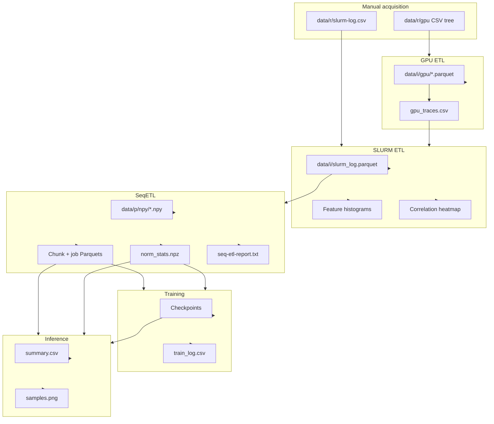
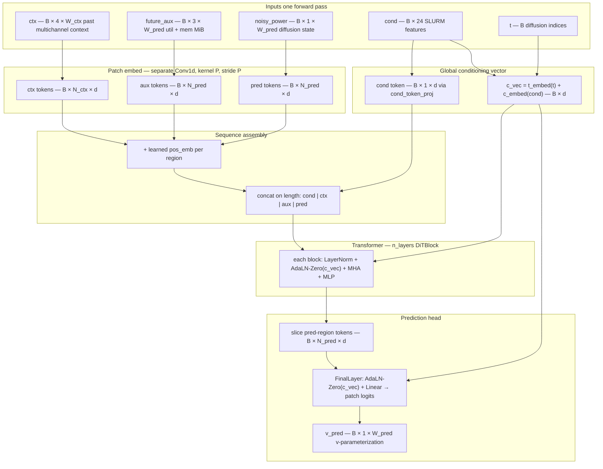

# Project Report: Generative GPU Power Modeling for MIT SuperCloud

**Software artifact:** `supercloud-power` (Python package, version 0.1.0)  
**Primary objective:** Build an end-to-end system that ingests SLURM scheduling metadata and time-aligned GPU telemetry, then trains a conditional diffusion model (**DiT-AR v5**) to synthesize **GPU power draw** trajectories under realistic operational constraints.

This document serves as both the **technical report** for the project and the **operator guide** for reproducing the pipeline. Repository paths and hyperparameters may evolve; authoritative numeric settings live in `configs/*.yaml`.

---

## Executive summary

The project addresses **data-driven modeling of GPU power consumption** on a shared HPC cluster. Raw inputs consist of (1) **per-job, per-node GPU metric CSVs** and (2) a **SLURM accounting export**. After deterministic preprocessing (resampling, cross-node aggregation, feature engineering, and normalization), each job becomes a **four-channel time series** at approximately **0.103 s** resolution. A **sliding-window autoregressive diffusion transformer** predicts the **power** channel conditioned on **24-dimensional SLURM features** and **observed future auxiliary signals** (utilization and memory footprint). Training supports **multi-GPU DDP**; evaluation on held-out **test jobs** reports **Pearson correlation**, **RMSE**, and **MAE** in watts, alongside qualitative **trace plots**.

---

## 1. Introduction

### 1.1 Motivation

Understanding and forecasting GPU power draw supports capacity planning, scheduling policies, and energy-aware workload management. Fully physics-based models are difficult to calibrate across heterogeneous workloads; this project instead learns a **generative model** directly from **operational telemetry** tied to **job-level scheduler context**.

### 1.2 Problem statement

Given a job’s **scheduler-derived conditioning vector** and a **fixed-length history** of multivariate GPU signals (including partial knowledge of the future auxiliary channels within each prediction window), estimate the **future power trajectory** so that synthetic traces are statistically plausible compared to held-out measurements.

### 1.3 Scope

**In scope:** offline batch ETL, model training, batch inference, standardized metrics and plots, example SLURM driver scripts.  
**Out of scope:** live integration with the scheduler, automated raw-data ingestion from SuperCloud (operators supply exports), and certification of safety or fairness claims beyond documented metrics.

---

## 2. System overview

The implementation splits naturally into **CPU-bound data preparation** and **GPU-bound learning**:

| Layer | Technology | Function |
|-------|------------|----------|
| ETL | pandas, pyarrow, multiprocessing | Cleaning, alignment, joins, Parquet/NPY materialization |
| Modeling | PyTorch | DiT-AR v5, diffusion training, optional DDP |
| Evaluation | NumPy, matplotlib (Agg) | Scalar metrics and publication-style trace overlays |

Figure A‑1 (Appendix A) summarizes file-level dependencies between stages; Figure B‑1 (Appendix B) summarizes the DiT-AR v5 forward dataflow.

---

## 3. Data and assumptions

### 3.1 Raw inputs (operator-supplied)

The codebase does **not** download cluster data. Operators must place:

- **`data/r/gpu/`** — Tree of CSV files conforming to `configs/gpuETL.yaml` (`glob_pattern`, `filename_pattern` extracting `job_id`).
- **`data/r/slurm-log.csv`** — SLURM export with columns listed under `slurm_usecols` in `configs/slurmETL.yaml`.

**Assumption:** `job_id` values are **consistent** across GPU filenames and SLURM `id_job` (after rename). SLURM rows without a corresponding GPU trace are **dropped** by an inner merge.

### 3.2 Derived channel semantics

Each prepared trace is **`(4, T)` float32** with channel order:

1. `gpu_used_pct` — linear scaling from percentage toward approximately \([-1, 1]\).  
2. `memory_used_pct` — same.  
3. `memory_used_MiB` — \(\log(1+x)\) then **train-fit** z-score.  
4. `power_draw_W` — \(\log(1+x)\) then **train-fit** z-score; **sole diffusion target**.

Normalization statistics are computed **only from training jobs** and stored in `norm_stats.npz`.

### 3.3 Train / test protocol

**SeqETL** performs a **job-level** split (`test_frac`, `seed`; optional stratification). There is **no separate validation split** inside the training loop; **generalization is assessed** by running **inference on test jobs** (Section 6).

---

## 4. Methodology

### 4.1 Stage 1 — GPU ETL

**Implementation:** `src/etl/gpu.py`, configuration `configs/gpuETL.yaml`.  
**Procedure (summary):** Discover jobs; optionally skip completed Parquets; per-node CSV filtering by inferred sampling interval; binning to a dense grid; cross-node aggregation (mean vs sum per metric); job-level quality gates (`min_node_keep_ratio`); atomic Parquet writes with **footer metadata** (`job_id`, `length`, `duration_sec`, `delta_t`, `nodes_used`); rebuild **`gpu_traces.csv`** with optional **duration bounds** filtering.

**Operational note:** A full pass requires invoking **`GpuETL().run()`**. Running `python src/etl/gpu.py` alone executes **trace index reconstruction** only, not CSV→Parquet conversion (Appendix C).

### 4.2 Stage 2 — SLURM ETL

**Implementation:** `src/etl/slurm.py`, configuration `configs/slurmETL.yaml`.  
**Procedure:** Inner merge of SLURM table with `gpu_traces.csv`; feature construction (cyclical time features, quantile transforms, one-hot encodings); export **`slurm_log.parquet`**.  
**Diagnostic outputs:** Histogram grid (`paths.plot`) and correlation heatmap (`paths.corr`), requiring matplotlib, seaborn, and scikit-learn.

### 4.3 Stage 3 — Sequence ETL (SeqETL)

**Implementation:** `src/etl/seq.py`, configuration `configs/seqETL.yaml`.  
**Procedure:** Five phases — load merged table; stratified split; fit normalization on train; convert Parquets to NPY with clipping and atomic writes; build **`train_*` / `test_*` chunk and job** Parquet indices. A textual **`seq-etl-report.txt`** captures phase logs; nonzero exit indicates NPY conversion failures.

**Fast path:** `python src/etl/seq.py --chunks-only` rebuilds chunk indices when window geometry changes but NPY files remain valid.

### 4.4 Model — DiT-AR v5

**Implementation:** `src/model/ditArV5.py`; hyperparameters in `configs/v5.yaml`.

The model is a **diffusion transformer** with:

- **Patch embedding** over context (`W_ctx`), future auxiliary (`W_pred`), and noisy power tokens (`W_pred`).  
- **AdaLN-Zero** modulation from the SLURM conditioning vector and diffusion timestep embedding.  
- **v-prediction** objective with a **cosine** \(\beta\) schedule (`diffusion_T` steps).  
- Optional **gradient checkpointing** (`use_checkpoint`) for memory-constrained GPUs.

**Training** (`src/model/train.py`): masked MSE respecting job length (`pred_mask`), AdamW with warmup+cosine decay, gradient clipping, CFG-style conditioning dropout, **EMA** of weights, optional **scheduled sampling** noise injection on past power in late epochs, **mixed precision** (bf16 when supported), and **DDP** when multiple GPUs are visible. Checkpoints use atomic writes; **`ema.pt`** is preferred for downstream inference.

**Inference** (`src/model/inference.py`): **sliding-window autoregressive** rollout with **DDIM** and optional **classifier-free guidance**; denormalization uses `norm_stats.npz`.

Tensor shapes, token layout, and block connectivity are shown schematically in **Appendix B (Figure B‑1)**.

### 4.5 Configuration coupling

**Requirement:** `configs/v5.yaml` must remain consistent with `configs/seqETL.yaml` on `sequence.W_ctx`, `sequence.W_pred`, `sequence.stride`, `sequence.patch_size`, and the **`slurm_feature_cols`** list (24 dimensions). Inconsistency produces shape errors or silent distribution mismatch between training and inference.

---

## 5. Implementation and repository structure

| Component | Path | Role |
|-----------|------|------|
| GPU ETL config | `configs/gpuETL.yaml` | Raw CSV → Parquet + trace index |
| SLURM ETL config | `configs/slurmETL.yaml` | Join + engineered features |
| SeqETL config | `configs/seqETL.yaml` | NPY + chunk/job tables + stats |
| Pipeline config | `configs/v5.yaml` | Model, train, inference, paths |
| Dataset | `src/etl/chunk.py` | mmap-backed `PowerTraceDataset` |
| Training driver | `src/model/train.py` | DDP, AMP, logging, checkpoints |
| Thin launcher | `src/model/main.py` | Loads `configs/v5.yaml`, invokes training |
| Inference | `src/model/inference.py` | Metrics + plots |
| HW probe | `src/shared/detect_hw.py` | CPU/GPU discovery |
| Batch scripts | `scripts/train.sh`, `scripts/inference.sh` | Example SLURM submission |
| Interactive helper | `scripts/terminal.sh` | tmux / Jupyter tunnel workflow |

**Exploratory artifacts:** `src/etl/model_power_traces_v4.ipynb`, root `app.ipynb` (not required for batch reproduction).

---

## 6. Evaluation protocol

### 6.1 Metrics

For each test job with generated power \(\hat{p}\) and measured power \(p\) (both in **watts** after denormalization):

- **Pearson correlation** \(r\) along the overlapping length (undefined when variance is negligible).  
- **RMSE** \(\sqrt{\mathbb{E}[(p-\hat{p})^2]}\).  
- **MAE** \(\mathbb{E}[|p-\hat{p}|]\).

Aggregates (mean/median over jobs, fraction above correlation thresholds) are printed at the end of inference and recorded in **`summary.csv`**.

### 6.2 Figures

- **SLURM ETL:** feature histograms and correlation heatmap (Section 4.2).  
- **Inference:** **`samples.png`** — multi-panel **real vs generated** power traces for a duration-stratified subset of jobs (`plot_n_samples`, configurable). Optional per-job **`trace_{job_id}.csv`** when `save_per_job_traces` is enabled.

### 6.3 Training diagnostics

**`train_log.csv`** (under the checkpoint directory) records `step`, `epoch`, `lr`, `loss`, and `n_skipped` at configured intervals. This file is the primary artifact for diagnosing instability or divergence; the codebase does not emit automatic validation curves during training.

---

## 7. Reproducibility

### 7.1 Environment

- Python \(\geq\) 3.10  
- Editable install from repository root:

```bash
cd /path/to/supercloud_power
pip install -e ".[etl,train]"
```

Optional: `.[dev]` for pytest/ruff. SLURM plotting and inference figures require the additional libraries noted in Section 4.2 and Section 6.2.

### 7.2 Execution sequence

All commands assume the **repository root** as the working directory.

```bash
# Stage 1 — GPU ETL (full pass)
python -c "from src.etl.gpu import GpuETL; import sys; sys.exit(GpuETL().run())"

# Stage 2 — SLURM ETL (+ diagnostic plots)
python src/etl/slurm.py

# Stage 3 — SeqETL
python src/etl/seq.py

# Stage 4 — Training
python src/model/train.py --config configs/v5.yaml

# Stage 5 — Inference / evaluation
python src/model/inference.py --config configs/v5.yaml --ckpt_dir output/v5/ckpt
```

Alternative training entrypoint: `python src/model/main.py` (hardcoded `configs/v5.yaml`).

### 7.3 High-performance computing

`scripts/train.sh` and `scripts/inference.sh` illustrate **sbatch** submission with site-specific accounts, partitions, and Python paths. Operators must adapt `#SBATCH` directives and filesystem locations. `scripts/terminal.sh` documents an interactive pattern (tmux, JupyterLab, SSH tunneling).

---

## 8. Results reporting (operator-filled)

This repository ships **code and configuration**, not fixed benchmark tables. After inference, populate a results subsection here or in an external document using:

- **`data/inference/<run>/summary.csv`** — per-job and aggregate statistics.  
- **`samples.png`** — qualitative comparison plots.  
- **`train_log.csv`** — training stability narrative.

Recording the **Git commit hash**, **`configs/v5.yaml`** snapshot, and **dataset vintage** (export dates) is recommended for any publication or internal review.

---

## 9. Limitations and future work

- **No automated raw ingestion or GDPR/security audit** — data handling remains the operator’s responsibility.  
- **Inner merge dependency** — jobs lacking GPU traces are excluded entirely from modeling.  
- **Auxiliary channels assumed known** during each prediction window at inference time — this matches a planning scenario where utilization proxies are forecast separately; relaxing it requires architectural changes.  
- **`torch.compile`** may be disabled in configuration to avoid long idle periods on managed clusters (see comments in `configs/v5.yaml`).  

Potential extensions include dedicated validation splits, calibrated probabilistic scores, multi-cluster transfer, and coupling to external workload forecasts.

---

## 10. Data and licensing notice

The repository contains **software only**. MIT SuperCloud telemetry exports are **not redistributed** here. Operators must comply with applicable **data use agreements** when copying exports into `data/r/`.

---

## Appendix A — End-to-end data flow



SeqETL reads GPU Parquet files via **`file_path`** embedded in `slurm_log.parquet`, not by reparsing `gpu_traces.csv`.

---

## Appendix B — DiT-AR v5 model architecture (Figure B‑1)

**Implementation:** `src/model/ditArV5.py` (`DiT_AR_v5`). **Configuration:** `model:` in `configs/v5.yaml` (`d_model`, `n_heads`, `n_layers`, `mlp_ratio`, `patch_size` \(P\), `W_ctx`, `W_pred`, `cond_dim`, `use_checkpoint`, …).

**Token count.** With \(N_{\mathrm{ctx}} = W_{\mathrm{ctx}}/P\) and \(N_{\mathrm{pred}} = W_{\mathrm{pred}}/P\), the sequence has  
\(N_{\mathrm{tokens}} = 1 + N_{\mathrm{ctx}} + 2\,N_{\mathrm{pred}}\)  
(one SLURM **cond** token, context patches, auxiliary patches, noisy-power patches). For the default `v5.yaml` layout (\(W_{\mathrm{ctx}}=16384\), \(W_{\mathrm{pred}}=8192\), \(P=16\)): \(N_{\mathrm{ctx}}=1024\), \(N_{\mathrm{pred}}=512\), hence \(N_{\mathrm{tokens}}=2049\).

**Classifier-free guidance (training/inference).** Optional `cond_drop_mask` replaces `cond` with a learned **`null_cond`** vector before both the in-sequence cond token path and the AdaLN **`c_embed`** path (`c_embed` still uses dropped cond; time embedding is unchanged).

**Gradient checkpointing.** When `use_checkpoint: true`, each `DiTBlock` forward is wrapped in `torch.utils.checkpoint.checkpoint` (`use_reentrant=False`) so activation memory scales roughly with one block depth instead of all layers.



**Training vs inference.** The same forward map produces **`v_pred`**; the loss compares **`v_pred`** to the diffusion target **`v`** derived from clean power and noise (`DiffusionSchedule` in-code). At inference, **`inference.py`** repeatedly calls the network inside a **DDIM** loop to obtain denoised power for each AR window.

---

## Appendix C — Procedural detail by stage

This appendix preserves the **step-by-step operational checklist** (quality gates, artifacts, and plotting hooks) for audit and onboarding.

### C.0 Data placement checklist

| Location | Requirement |
|----------|-------------|
| `data/r/gpu/` | CSV tree matching `gpuETL.yaml` patterns |
| `data/r/slurm-log.csv` | Columns per `slurmETL.yaml` |

Spot-check `job_id` overlap between exports; no checksum tooling is provided.

### C.1 GPU ETL gates

- Sampling interval probe outside `[delta_t_min, delta_t_max]` rejects a node file.  
- `min_node_keep_ratio` failures flag entire jobs.  
- Atomic Parquet writes; footer metadata for downstream indexing.  
- `gpu_traces.csv` filtered by configured duration bounds.

### C.2 SLURM ETL gates

- Abort if merge yields zero rows.  
- State masking and one-hot scheme per YAML.

### C.3 SeqETL gates

- Non-finite feature removal; `length > 0`.  
- Train-only statistics for `log1p_zscore` channels.  
- Exit code 1 if any NPY conversion fails.

### C.4 Training gates

- CUDA free-memory preflight (detects zombie contexts).  
- DDP uses `forkserver` DataLoader context to avoid NCCL deadlocks.  
- Loss outlier threshold with rank-coordinated skip under DDP.  
- Signal handlers for graceful checkpoint on SIGTERM / SIGUSR1 / SIGUSR2.

### C.5 Inference outputs

Per-job **`pearson_r`**, **`rmse`**, **`mae`** in `summary.csv`; **`synth/*.npy`** (normalized space); **`samples.png`** for qualitative review.

---

## Appendix D — ASCII pipeline sketch

```text
data/r/gpu/**/*.csv     ──GpuETL──► data/i/gpu/*.parquet ──┐
                                                           ├──► gpu_traces.csv
data/r/slurm-log.csv    ─────────────────► inner merge ────┘
                                  │
                                  ▼
                         SlurmETL ──► data/i/slurm_log.parquet
                                  │
                                  ▼
                         SeqETL ──► data/p/npy/*.npy
                                   data/p/{train,test}_{jobs,chunks}.parquet
                                   data/p/norm_stats.npz
                                  │
                                  ▼
                         train.py ──► output/.../ckpt/*.pt
                                  │
                                  ▼
                         inference.py ──► summary.csv, samples.png
```

Failure triage: confirm merged Parquet columns satisfy SeqETL (`job_id`, `file_path`, `length`, `duration_sec`, and all `slurm_feature_cols`).

