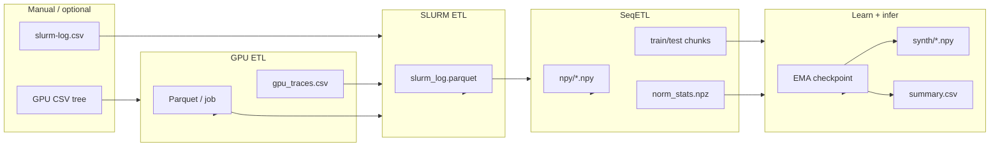
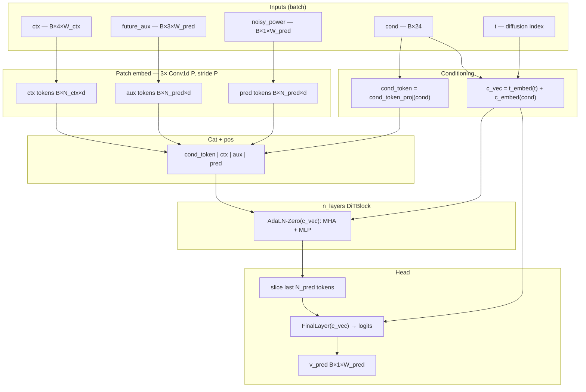
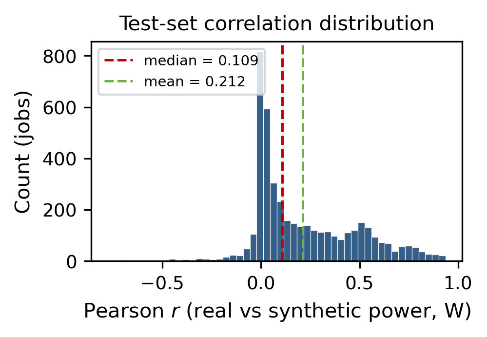
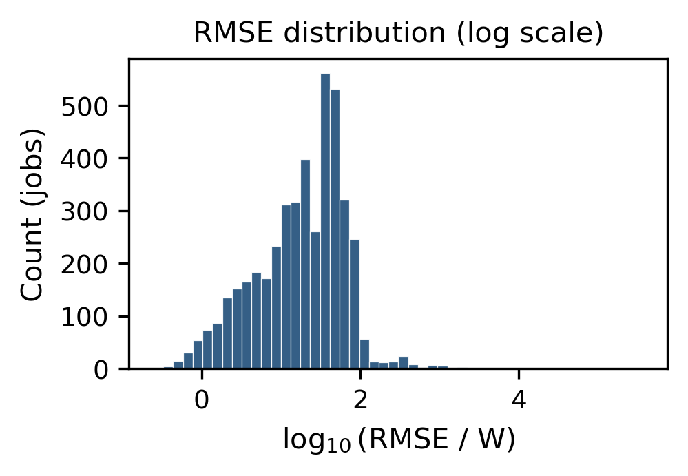
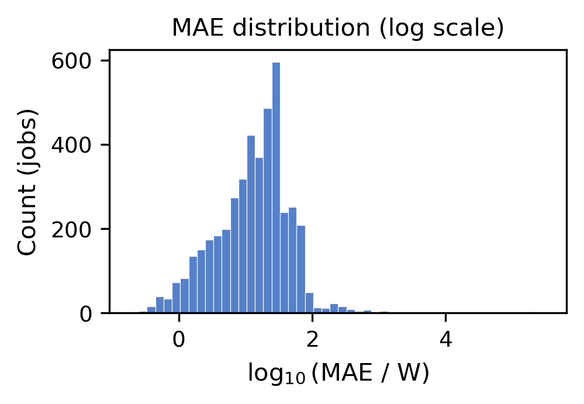
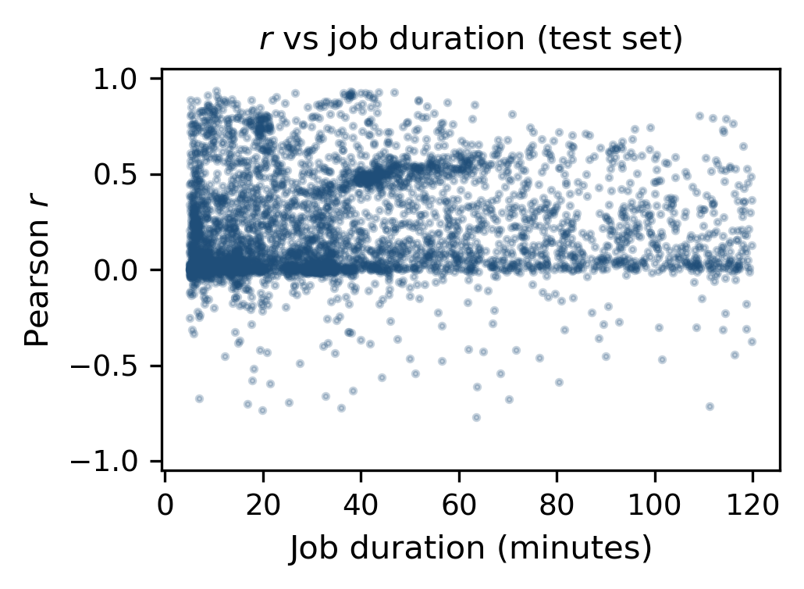

# Generative Diffusion Transformer for GPU Power Trajectories Conditioned on HPC Scheduler Metadata

**Authors:** [Author names withheld for review — replace with IEEE-style author block: *First I. Last, Affiliation, City, Country, email@domain*]

**Corresponding software artifact:** `supercloud-power` v0.1.0 (Python 3.10+, PyTorch).  
**Note:** This Markdown file mirrors an **IEEE Conference / Transactions–style** structure. For camera-ready output, import sections into **IEEEtran** (\documentclass[conference]{IEEEtran}) and replace Markdown figures with `\includegraphics` and vector PDFs where required.

---

## Abstract

**Abstract** — Accurate modeling of **GPU power draw over time** supports energy-aware capacity planning and workload analysis on shared high-performance computing (HPC) clusters. We present an end-to-end pipeline that couples **SLURM accounting features** with **sub-second, per-job GPU telemetry**, materializes **four-channel** traces at approximately **0.103 s** resolution, and trains **DiT-AR v5**, a **sliding-window autoregressive diffusion transformer** that generates the **power** channel conditioned on a **24-D scheduler vector**, a long **multivariate context**, and **oracle future auxiliary** signals (utilization and memory) within each prediction window. The backbone uses **non-overlapping patch embeddings**, a **prefix SLURM conditioning token**, **AdaLN-Zero** modulation driven by **diffusion timestep** and **global conditioning**, **v-prediction** under a **cosine** noise schedule, **classifier-free guidance**, and **DDIM** sampling. Evaluation on **4,404** held-out jobs (`results/summary.csv`) yields **mean** Pearson **r = 0.212** (**median** **0.109**); **32.4%** of jobs achieve **r > 0.30**; **median** **RMSE ≈ 20.9 W** and **MAE ≈ 15.0 W**, with **heavy-tailed** errors on a subset of high-power traces. We provide system diagrams, distribution plots, and representative **real-vs-synthetic** overlays, and we discuss the **oracle auxiliary** assumption and reproducibility.

**Index Terms** — GPU power modeling, HPC energy, SLURM, diffusion models, diffusion transformer, time series generation, autoregressive inference, MIT SuperCloud.

---

## I. INTRODUCTION

RISING GPU density in datacenters and shared HPC systems makes **time-resolved power** a critical quantity for **scheduling**, **cooling design**, and **carbon accounting** [1]. Purely physics-based or hand-tuned models struggle to span **heterogeneous** user workloads and burst patterns observed in the field. **Machine learning** from **telemetry** offers a complementary path: learn a **conditional generative model** that respects both **scheduler context** (requested resources, priority, calendar time) and **local GPU state** (utilization, memory).

This work targets **MIT SuperCloud–class** exports: **per-job GPU metric CSVs** aligned with a **SLURM** table. The **scientific question** is whether a **single scalable architecture** can synthesize **realistic watt trajectories** at **tens to hundreds of milliseconds** per sample when (i) **scheduler metadata** are available as a fixed-length feature vector and (ii) **non-power** channels over the **prediction horizon** are treated as **known** (oracle) within each window—a setting relevant to **what-if analysis** when auxiliary traces are supplied by a separate forecaster or scenario template.

**Contributions** are:

1. **Reproducible ETL** — GPU CSV → **Parquet** → inner-join **SLURM** features → **train-only normalization** → memory-mapped **NPY** and chunk indices with explicit quality gates and atomic writes (§III).

2. **DiT-AR v5** — A **conditional diffusion transformer** with **three Conv1d patch stems** (context, future auxiliary, noisy power), **2049** tokens at default geometry, **AdaLN-Zero** blocks, **SLURM** prefix token, **v-prediction**, **CFG** training dropout, **EMA**, **scheduled sampling**, and optional **DDP** (§IV–V).

3. **Aligned autoregressive inference** — Non-overlapping **\(W_{\mathrm{pred}}\)** stride, **DDIM** denoising, **CFG**, and **stitching** that feeds **generated** power into the context stream after the first window (§V).

4. **Empirical study** — Job-level **Pearson r**, **RMSE**, **MAE** in **watts** on **4,404** test jobs, plus **histograms**, **scatter** analysis, and **multi-panel** trace figures (§VII).

**Organization.** Section II situates the work. Section III describes data and preprocessing. Section IV details architecture and conditioning. Section V covers training and inference. Section VI states protocol. Section VII reports quantitative and qualitative results. Section VIII discusses limitations. Section IX concludes.

---

## II. BACKGROUND AND RELATED WORK

**HPC power and energy.** Traditional approaches combine **RAPL**-style counters, **vendor telemetry**, and regression from **aggregate** utilization to **average** power. Few public artifacts release **job-granular** **sub-second** traces **joined** to **scheduler** exports for **generative** modeling.

**Diffusion models** learn to reverse a noise process [2], [3]. **v-prediction** reparameterization improves stability on continuous targets [4]. **Classifier-free guidance (CFG)** [5] trades diversity for **adherence** to **conditioning**.

**Diffusion transformers (DiT)** [6] apply **ViT-style** patching and **AdaLN** modulation from **global** embeddings. Our **DiT-AR v5** adapts this pattern to **three aligned patch streams** plus a **scalar conditioning prefix**, and couples it to **autoregressive** long-horizon generation.

---

## III. DATA ACQUISITION AND PREPROCESSING PIPELINE

### A. Raw inputs

Operators place **GPU** CSVs under `data/r/gpu/` (see `configs/gpuETL.yaml`) and **`data/r/slurm-log.csv`** (`configs/slurmETL.yaml`). Optional `src/etl/download.py` lists **unsigned** objects from `s3://mit-supercloud-dataset/datacenter-challenge/202201/`; it is **not** part of the default batch path. The repository **does not redistribute** raw telemetry by default.

### B. Stage 1 — GPU ETL

`src/etl/gpu.py` discovers jobs, validates sampling intervals against \([ \delta_t^{\min}, \delta_t^{\max} ]\), bins to a **dense** timeline, aggregates across nodes (**mean** vs **sum** per metric as configured), applies **`min_node_keep_ratio`**, and writes **atomic** **Parquet** per job with footer metadata (`job_id`, `length`, `duration_sec`, `delta_t`, `nodes_used`). A **`gpu_traces.csv`** index supports downstream joins.

### C. Stage 2 — SLURM ETL

`src/etl/slurm.py` performs an **inner merge** on **`job_id`**. Engineers **cyclical** hour/day encodings, **quantile-style** scalings, and **one-hot** encodings for **priority tier**, **job type**, and **state** buckets. Output: **`data/i/slurm_log.parquet`** and optional **histogram** / **correlation** diagnostics.

### D. Stage 3 — SeqETL

`src/etl/seq.py` applies a **job-level** split (`test_frac=0.10`, `seed=42`). **log1p + z-score** statistics for **`memory_used_MiB`** and **`power_draw_W`** are fit on **training jobs only** (`norm_stats.npz`). Each surviving job is stored as **`(4, T)` float32** NPY:

| Channel index | Name | Normalization |
|:--:|:--|:--|
| 0 | `gpu_used_pct` | Linear percent → \(\approx [-1,1]\) |
| 1 | `memory_used_pct` | Same |
| 2 | `memory_used_MiB` | \(\log(1+x)\), train **z-score** |
| 3 | `power_draw_W` | \(\log(1+x)\), train **z-score** (**diffusion target**) |

**Window geometry** (must match `configs/v5.yaml` and `configs/seqETL.yaml`): **\(W_{\mathrm{ctx}} = 16\,384\)**, **\(W_{\mathrm{pred}} = 8\,192\)**, **stride \(= W_{\mathrm{pred}}\)** (non-overlapping windows). At \(\Delta t \approx 0.103\,\mathrm{s}\), context \(\approx 28\,\mathrm{min}\); horizon \(\approx 14\,\mathrm{min}\).

`src/shared/chunk.py` implements **`PowerTraceDataset`**: **mmap** with **LRU** bounding of open files, **zero-padding** for partial windows, **`pred_mask`** for valid bins, and **O(1)** job-index arrays for scale.

### E. System dataflow (architecture)

**Fig. 1** summarizes the staged pipeline from raw exports to training and inference artifacts.

**Fig. 1.** End-to-end **dataflow**: GPU and SLURM exports (left) pass through **GPU ETL**, **SLURM ETL**, and **SeqETL**, producing **NPY** traces, **chunk indices**, and **normalization statistics**. **Training** writes **checkpoints**; **inference** writes **synthetic power** and **summary** metrics. *Mermaid diagram: render in GitHub / VS Code; for IEEE PDF export to SVG/PDF via `mmdc` or redraw in vector editor.*

---

## IV. PROPOSED ARCHITECTURE: DIT-AR V5

### A. Problem statement per window

For each **training chunk** indexed by job \(j\) and window \(i\), observe **context** \(\mathbf{X}_{\mathrm{ctx}} \in \mathbb{R}^{4 \times W_{\mathrm{ctx}}}\), **future auxiliary** \(\mathbf{A} \in \mathbb{R}^{3 \times W_{\mathrm{pred}}}\) (channels 0–2 of the future), **power ground truth** \(\mathbf{p}_0 \in \mathbb{R}^{1 \times W_{\mathrm{pred}}}\) (channel 3, normalized), and **SLURM** vector \(\mathbf{c} \in \mathbb{R}^{24}\). The diffusion model learns to **denoise** \(\mathbf{p}_t\) toward \(\mathbf{p}_0\) while attending to \(\mathbf{X}_{\mathrm{ctx}}\), \(\mathbf{A}\), and \(\mathbf{c}\), with **timestep** \(t \in \{0,\ldots,T-1\}\), \(T=1000\).

### B. Tokenization and layout

**Patch size** \(P=16\). Three **Conv1d** embedders (kernel **\(P\)**, stride **\(P\)**, no padding) map:

- \(\mathbf{X}_{\mathrm{ctx}} \rightarrow \mathbf{T}_{\mathrm{ctx}} \in \mathbb{R}^{B \times N_{\mathrm{ctx}} \times d}\), \(N_{\mathrm{ctx}} = W_{\mathrm{ctx}}/P = 1024\),
- \(\mathbf{A} \rightarrow \mathbf{T}_{\mathrm{aux}} \in \mathbb{R}^{B \times N_{\mathrm{pred}} \times d}\), \(N_{\mathrm{pred}} = W_{\mathrm{pred}}/P = 512\),
- \(\mathbf{p}_t \rightarrow \mathbf{T}_{\mathrm{pred}} \in \mathbb{R}^{B \times N_{\mathrm{pred}} \times d}\).

**Learned** positional biases **`pos_ctx`, `pos_aux`, `pos_pred`** are added (the SLURM prefix has **no** additive position). A linear projection **cond_token_proj\((\mathbf{c})\)** yields one **prefix token** \(\mathbf{t}_0 \in \mathbb{R}^{B \times 1 \times d}\). The **full** sequence is

\[
\mathbf{T} = \big[ \,\mathbf{t}_0 \,\|\, \mathbf{T}_{\mathrm{ctx}} \,\|\, \mathbf{T}_{\mathrm{aux}} \,\|\, \mathbf{T}_{\mathrm{pred}} \,\big],
\quad
N_{\mathrm{tokens}} = 1 + N_{\mathrm{ctx}} + 2 N_{\mathrm{pred}} = 2049.
\]

### C. Global conditioning and DiT blocks

**Timestep** embedding \(\psi(t)\) and **SLURM** embedding \(\phi(\mathbf{c})\) **combine as**

\[
\mathbf{g} = \psi(t) + \phi(\mathbf{c}) \in \mathbb{R}^{B \times d},
\]

which drives **AdaLN-Zero** in every **DiTBlock** (pre-norm **LayerNorm** without affine weights, **multi-head self-attention**, **MLP**, both branches modulated by \(\mathbf{g}\)). **Classifier-free guidance** replaces \(\mathbf{c}\) with a learned **null** embedding on a Bernoulli mask during training [5].

The **final** **AdaLN** + linear head maps the **last** \(N_{\mathrm{pred}}\) tokens to **patch** logits, reshaped to **v-prediction** \(\hat{\mathbf{v}} \in \mathbb{R}^{B \times 1 \times W_{\mathrm{pred}}}\).

### D. Forward-pass topology

**Fig. 2** depicts tensor routing and conditioning (implementation: `src/model/ditArV5.py`).

**Fig. 2.** **DiT-AR v5** forward topology: **three patch streams**, **SLURM prefix token**, joint **\(c_{\mathrm{vec}}\)** for **AdaLN-Zero**, and **v-output** on **pred** tokens only.

### E. SLURM feature vector (24-D)

**TABLE I** lists **conditioning groups** (exact column order in `configs/v5.yaml`).

**TABLE I**  
*SLURM conditioning groups (24 dimensions)*

| Group | Dim. | Description |
|:--|:--:|:--|
| Calendar harmonics | 4 | `hour_sin`, `hour_cos`, `dow_sin`, `dow_cos` |
| Resource / scale | 7 | `mem_unlimited`, `mem_req_scaled`, `nodes_req_is_one`, `nodes_req_log`, `cpus_req_scaled`, `duration_scaled`, `priority_scaled` |
| Priority tier | 3 | one-hot `ptier_*` |
| Job type | 4 | one-hot `type_*` |
| State bucket | 6 | one-hot `state_*` |

---

## V. TRAINING AND INFERENCE PROCEDURE

### A. Diffusion objective

We adopt a **cosine** \(\beta_t\) schedule with **v-parameterization** [4]: the network predicts \(\mathbf{v}\) from which \(\mathbf{p}_0\) and noise \(\boldsymbol{\epsilon}\) are recoverable (see `DiffusionSchedule` in `ditArV5.py`). The training loss is **masked MSE** on \(\hat{\mathbf{v}} - \mathbf{v}\) using **`pred_mask`** (zeros past job end).

### B. Optimization and stabilization

**TABLE II** summarizes **shipped** hyperparameters from `configs/v5.yaml` (comments in YAML document rationale such as **warmup vs total steps** and **regularization** on \(\sim 40\mathrm{k}\) jobs).

**TABLE II**  
*Key training / inference hyperparameters (`configs/v5.yaml`)*

| Item | Value | Item | Value |
|:--|:--|:--|:--|
| \(d_{\mathrm{model}}\) | 384 | \(n_{\mathrm{layers}}\) | 12 |
| \(n_{\mathrm{heads}}\) | 6 | **MLP ratio** | 4 |
| **Dropout** | 0.1 | **Patch** \(P\) | 16 |
| **Batch size** | 256 | **Epochs** | 160 |
| **LR** | \(1.5\times10^{-5}\) | **Weight decay** | 0.05 |
| **Warmup steps** | 500 | **Grad clip** | 1.0 |
| **CFG dropout** \(p\) | 0.05 | **EMA decay** | 0.9999 |
| **Diffusion** \(T\) | 1000 | **Checkpoint** EMA | `ema.pt` |
| **DDIM steps** | 50 | **CFG scale** | 3.0 |
| **Scheduled sampling** | from frac 0.40, \(p_{\max}=0.4\) | **t** range | [50, 200] |

**Additional mechanisms:** **mixed precision** (bf16 when supported), optional **DDP**, **CUDA preflight** and **forkserver** DataLoader context in `train.py`, **loss outlier** coordination under DDP, and **signal** handlers for graceful checkpointing.

### C. Autoregressive inference

`src/model/inference.py` iterates **non-overlapping** windows along each test job. For window \(k>0\), **context** **power** in \(\mathbf{X}_{\mathrm{ctx}}\) is **synthetic** from prior windows; **auxiliary** futures remain **observed** (oracle). Each window: **DDIM** ( \(\eta=0\) ) with **CFG**, then **append** generated **power** bins. Metrics convert **z-scores** on channel 3 back to **watts** via \(\mathrm{expm1}(z\sigma + \mu)\) and compute **Pearson r**, **RMSE**, **MAE**. Aggregates and **`samples*.png`** panels are written under `paths.inference_dir` (see also `results/` copies in this repo).

---

## VI. EXPERIMENTAL SETUP

- **Split:** job-level **10%** test, **seed 42** (`configs/seqETL.yaml`).
- **Evaluation set size:** **4,404** jobs in `results/summary.csv` (one row per job).
- **Hardware / training cluster:** not fixed by the repository; `configs/v5.yaml` documents **H200-class** VRAM planning and **`torch.compile` disabled** to avoid long kernel-compile idle on shared systems.
- **Comparator:** this artifact is **single-model**; baseline comparators (e.g., linear, LSTM, non-AR diffusion) are **future** controlled studies.

---

## VII. RESULTS

### A. Scalar metrics

**TABLE III** aggregates **Pearson r**, **RMSE**, and **MAE** over **4,404** jobs. **Means** for error metrics are **dominated** by a **heavy upper tail**; **medians** better reflect **typical** jobs.

**TABLE III**  
*Test-set metrics from `results/summary.csv` (4,404 jobs)*

| Metric | Mean | Median |
|:--|:--:|:--:|
| Pearson \(r\) | 0.212 | 0.109 |
| RMSE (W) | 309.0 | 20.9 |
| MAE (W) | 262.6 | 15.0 |
| **Fraction** \(r > 0.30\) | — | **0.324** |

### B. Distributional plots

**Fig. 3** shows the **test-set** distribution of **Pearson r** with **mean** and **median** reference lines.

**Fig. 4** displays \(\log_{10}\) **RMSE** and **Fig. 5** \(\log_{10}\) **MAE**, highlighting **tail mass** at high watt errors.

**Fig. 6** plots **Pearson r** versus **job duration** (minutes). Correlation is **heterogeneous** across durations.

### C. Qualitative trace panels (real vs synthetic)

Inference exports **stacked** matplotlib panels of **measured** vs **generated** power in **watts**. **Fig. 7–9** illustrate **best-ranked**, **randomly sampled**, and **worst-ranked** jobs by a selection criterion used when producing **`samples_*.png`** (see inference plotting logic in `src/model/inference.py`).

*Optional:* `results/samples.png` and mirrored copies under `data/inference/v5/` provide additional **stratified** panels from the same run configuration.

---

## VIII. DISCUSSION AND LIMITATIONS

1. **Oracle auxiliary** — Future **utilization** and **memory** are **observed** in each window at inference. This **lower-bounds** operational error relative to coupling with a **noisy auxiliary forecast**.

2. **Selection bias** — **Inner merge** on telemetry \(\cap\) SLURM **excludes** jobs without GPU exports.

3. **Metrics** — **r**, **RMSE**, **MAE** on **instantaneous** watts do not fully test **distributional** calibration (e.g., **CRPS**, **total energy**, **spectral** fidelity).

4. **Validation during training** — No held-out **validation loop** in `train.py`; **early stopping** and **checkpoint** selection currently rely on **operator** judgment + **test** inference.

5. **Reproducibility** — Report **Git commit**, `configs/v5.yaml`, **`norm_stats.npz`**, and **data vintage** in any derivative publication.

---

## IX. CONCLUSION

We presented **DiT-AR v5**, a **conditional diffusion transformer** that generates **GPU power trajectories** from **SLURM** metadata, **long multivariate context**, and **oracle** future non-power channels in each window, with **sliding-window autoregressive** deployment. A **three-stage ETL** stack, **mmap-backed** dataset, and **DDIM + CFG** inference form a **reproducible** artifact. On **4,404** test jobs, **median** errors reach **\(\sim 20\,\mathrm{W}\)** **RMSE** with **mixed** correlation; **tail** behavior warrants **robust losses** and **auxiliary forecasting** in future work.

---

## ACKNOWLEDGMENT

[Funding, MIT SuperCloud operations team, and data providers — **to be completed by authors**.]

---

## REFERENCES

[1] J. G. Koomey, "Growth in data center electricity use 2005 to 2010," Analytics Press, Oakland, CA, USA, Tech. Rep., 2011. *(Representative energy context citation — replace with venue-appropriate datacenter / HPC energy references.)*

[2] J. Ho, A. Jain, and P. Abbeel, "Denoising diffusion probabilistic models," in *Proc. NeurIPS*, 2020.

[3] Y. Song and S. Ermon, "Generative modeling by estimating gradients of the data distribution," in *Proc. NeurIPS*, 2019.

[4] T. Salimans and J. Ho, "Progressive distillation for fast sampling of diffusion models," *arXiv preprint arXiv:2202.00512*, 2022.

[5] J. Ho and T. Salimans, "Classifier-free diffusion guidance," *arXiv preprint arXiv:2207.12598*, 2022.

[6] W. Peebles and S. Xie, "Scalable diffusion models with transformers," in *Proc. ICCV*, 2023.

[7] A. Vaswani et al., "Attention is all you need," in *Proc. NeurIPS*, 2017.

---

## APPENDIX A — FIGURE AND DATA MANIFEST

| ID | File (relative to repo) | Description |
|:--:|:--|:--|
| Fig. 3 | `results/ieee_figs/ieee_hist_pearson_r.png` | Histogram of \(r\) |
| Fig. 4 | `results/ieee_figs/ieee_hist_rmse_log10.png` | \(\log_{10}\) RMSE |
| Fig. 5 | `results/ieee_figs/ieee_hist_mae_log10.png` | \(\log_{10}\) MAE |
| Fig. 6 | `results/ieee_figs/ieee_scatter_r_vs_duration.png` | \(r\) vs duration |
| Fig. 7–9 | `results/samples_{best,random,worst}.png` | Trace panels |
| Data | `results/summary.csv` | Per-job metrics |

*Figures 3–6 were generated by embedded analytics on `results/summary.csv` (matplotlib, 300 dpi).*

---

## APPENDIX B — IEEEtran LATEX MIGRATION (OPERATORS)

1. `\documentclass[conference]{IEEEtran}`
2. Copy **Abstract**, **Index Terms**, sections **I–IX**.
3. Replace Markdown **figures** with `\begin{figure}...\includegraphics[width=\linewidth]{...}\end{figure}` and `\label{fig:...}`.
4. Replace **TABLE I–III** with `booktabs` or IEEE **table** float.
5. Run **BibTeX** for **IEEEtran** bibliography style on expanded references.

---

*Manuscript version tied to repository artifact `supercloud-power` v0.1.0.*
